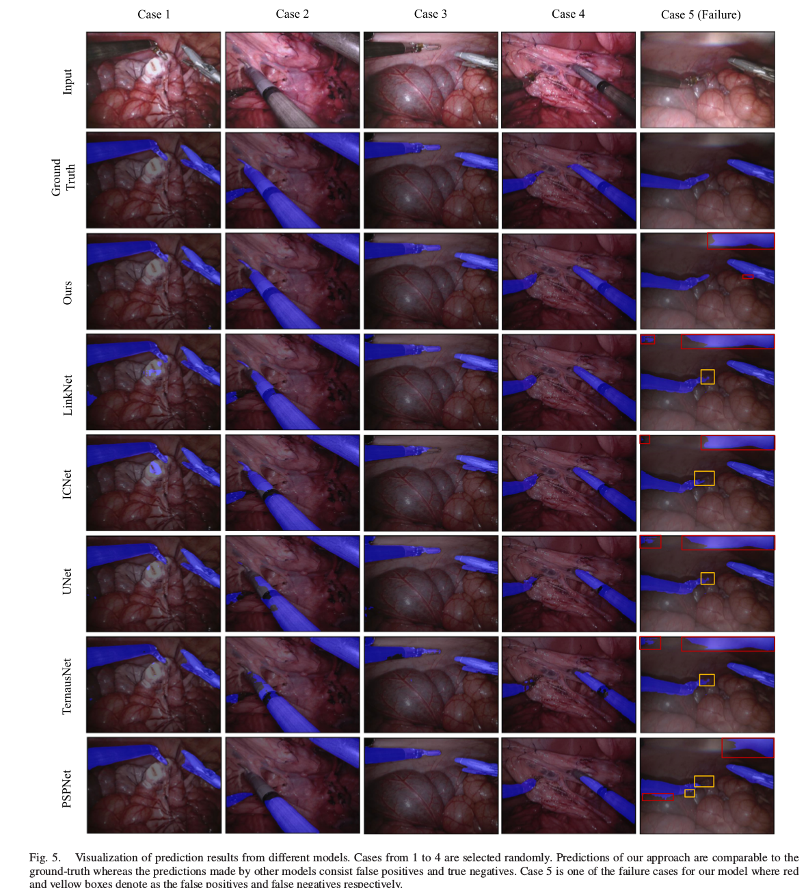

# Surgical_Instruments_Segmentation
This repository is the implementation of the paper [Real-Time Instrument Segmentation in Robotic Surgery Using Auxiliary Supervised Deep Adversarial Learning](https://ieeexplore.ieee.org/abstract/document/8648150).

[MICCAI Surgical Instrument Segmentation Challenge 2017](https://endovissub2017-roboticinstrumentsegmentation.grand-challenge.org/)
dataset is used to conduct all the experiments in this paper. The dataset is split into train and validation set as:

Train Set: 1,2,3,4,5,6

Validation Set: 7,8 

[Trained model in type wise segmentation](https://drive.google.com/file/d/10s1NQhbJsEUDsrax7MvQWQUwOwSucsDi/view?usp=sharing) 

### Architectures
</img>

### Results: Binary Prediction
</img>
